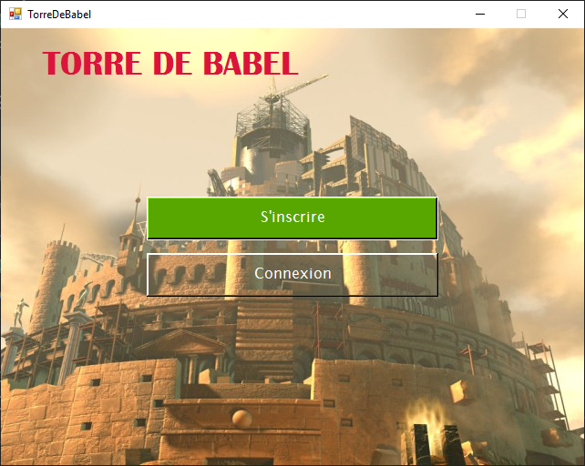
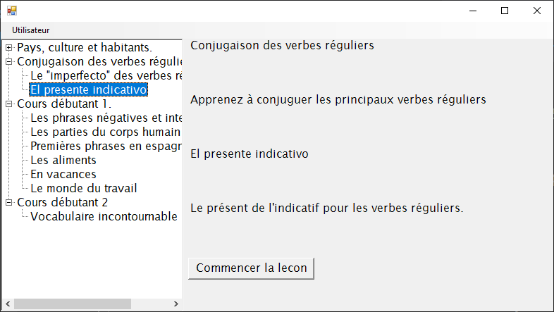
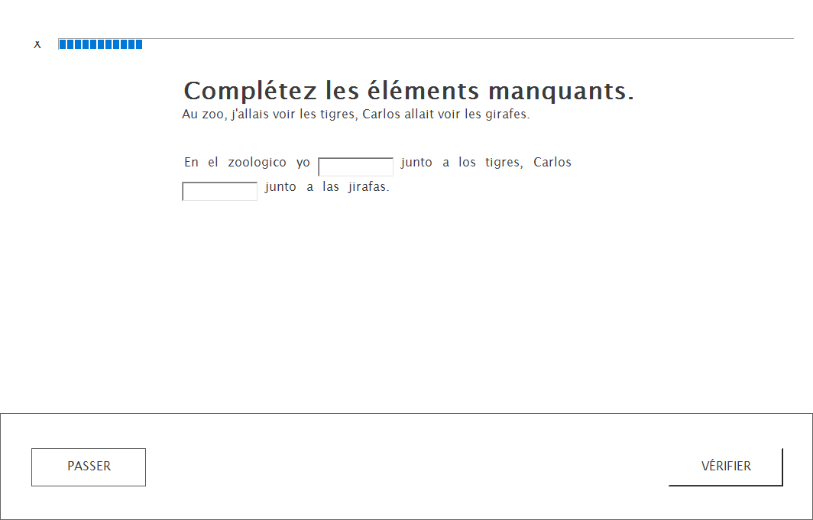
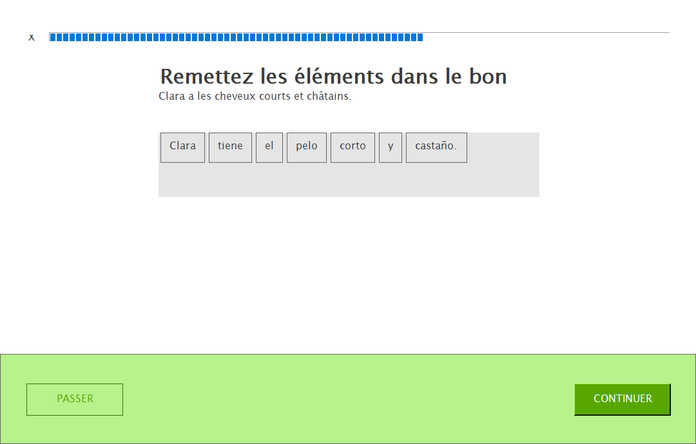
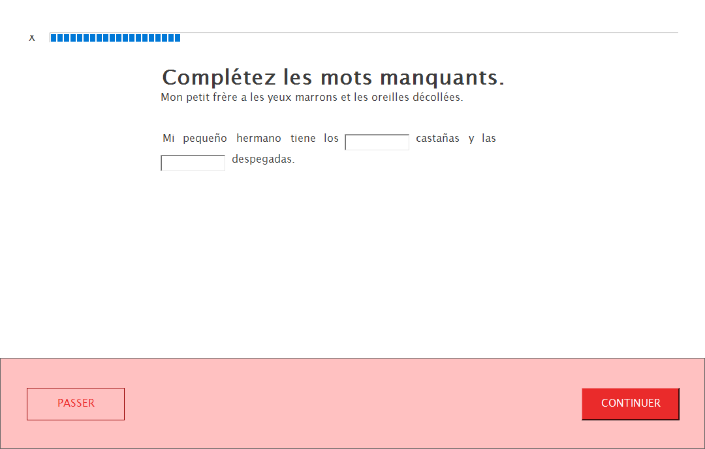

Compte-rendu au 28/05
---------------------
Le formulaire de démarrage est à peu près fini, reste à améliorer l'ergonomie du
formulaire de login et faire le formulaire d'inscription (pas vraiment
important).

Le tableau de bord est très primitif pour l'instant, mais il fonctionne.
J'améliorerai l'interface quand le reste sera fini.

L'interface du formulaire de la leçon est à peu près correcte, reste à faire une
ProgressBar plus intuitive, gérer la disposition des contrôles et donner un
feedback à l'utilisateur pour chaque exercice.

Les exercices de phrases dans le désordre et phrases à trous marchent mais il
reste à autoriser les mots non accentués et/ou ajouter des boutons pour les
caractères espagnols qui ne sont pas sur le clavier français.

Pour ce qui est de la liaison de données, il reste à synchroniser avec la base
l'avancement de l'utilisateur.
